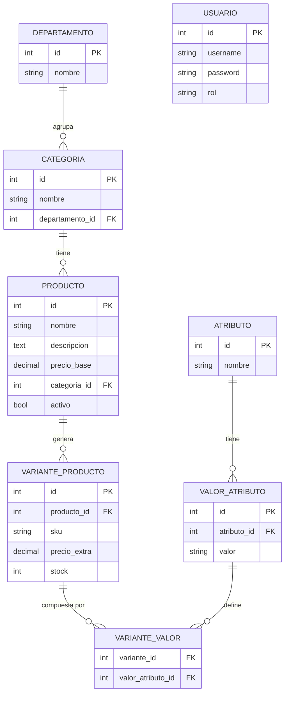

# Gestion de Productos

## Proyecto full-stack para Taller de Programación 4

### Integrantes del grupetete

- Andre Busnelli
- Manuela Cepeda
- Gregorio Dib
- Enrique Thedy

Asignatura: Uiversidad Nacional de Rosario - Instituto Politécnico Superior - Analista Universitario en Sistemas - Taller de Programación 4

### Información General del Proyecto
**Arquitectura:** Aplicación web Full-Stack (Desacoplada)
**Propósito:** Sistema de Gestión de Productos
**Estructura:**
- **Backend:** 
    - Framework: Spring Boot 4.x / Java 17+
    - Gestor de Proyectos: **Apache Maven 3.6+** (Gestión de ciclo de vida y dependencias)
- **Frontend:** 
    - Framework: Angular v21 (Single Page Application)
    - Gestor de Paquetes: Node Package Manager (npm)

### Descrición
Sistema de gestión de inventario con productos, variantes (talle/color/etc.), autenticación por roles y filtrado en tiempo real, implementado como una API REST en Spring Boot consumida por una SPA en Angular.

### Instrucciones rápidas
1. Clonar el repositorio
  ```bash
  git clone https://github.com/aus-paladins/taller4_gestion_productos.git
  cd taller4_gestion_productos
  ```
2. Levantar backend desde Maven (Spring Boot):
```bash
cd gestorback
./mvnw spring-boot:run
```
3. Levantar el frontend (Angular)
```bash
cd gestorfront
npm install
npm start
```

## Objetivo y alcance

La consigna pedía un sistema de gestión con backend y frontend, ORM, seguridad JWT, y al menos dos roles (`admin` / `guest`), manteniendo el modelo enfocado ("5-7 entidades"). El proyecto quedó con **7 entidades** (`Departamento`, `Categoria`, `Producto`, `VarianteProducto`, `Atributo`, `ValorAtributo`, `Usuario`), justo en ese rango.

La decisión de modelado central fue distinguir **Producto** (lo conceptual: "Remera Básica", con nombre, descripción y precio base) de **VarianteProducto** (lo vendible: "Remera Básica, Talle M, Azul", con su propio SKU, stock y precio). Un producto define qué atributos aplican (Talle, Color) y cada variante fija un valor concreto para cada uno.

## Modelo de dominio



`USUARIO` no tiene relación con el resto del modelo: es la entidad de autenticación (`rol` es `ADMIN` o `INVITADO`), separada del dominio de catálogo a propósito.


## Arquitectura del backend

**Stack:** Spring Boot 4 (Java 21), Spring Data JPA + Hibernate, Spring Security + JWT (jjwt), base H2 en memoria.

### Capas

El backend sigue una arquitectura en capas clásica, repetida de forma consistente para las 6 entidades de catálogo (`Departamento`, `Categoria`, `Producto`, `Atributo`, `ValorAtributo`, `VarianteProducto`):

```
    DTO  ←──── Controller
     ↕          ↑     ↓
   Mapper ←──   Service (interfaz + impl)
     ↕          ↑     ↓
   Entity ←──  Repository
   (JPA)          ↑↓
                  db
```

- **Entity**: clases anotadas con `@Entity`, relaciones JPA (`@ManyToOne`, `@ManyToMany`) entre ellas.
- **Repository**: interfaces `JpaRepository`, con Spring Data resolviendo el CRUD básico.
- **Service**: contiene la lógica de negocio; cada entidad tiene su interfaz (`IProductoService`, etc.) e implementación, para poder mockear en tests o cambiar la implementación sin tocar el controller.
- **DTO / Mapper**: los controllers nunca exponen las entidades JPA directamente. Cada entidad tiene su `RequestDTO` (lo que llega en el body) y `ResponseDTO` (lo que se devuelve), con un `Mapper` estático que traduce entre entidad y DTO. Esto evita filtrar detalles de persistencia (relaciones lazy, ciclos de serialización o referencia circular) al contrato HTTP.
- **Controller**: `@RestController` por entidad, con las 5 operaciones REST estándar (`GET` lista, `GET /{id}`, `POST`, `PUT /{id}`, `DELETE /{id}`), todas siguiendo la misma convención de rutas (`/api/productos`, `/api/categorias`, etc.).

### El endpoint de lectura para el listado

`GET /api/variantes/listado` es la excepción al patrón anterior: no es un CRUD genérico, es un endpoint de lectura hecho a medida para la pantalla principal del frontend. Devuelve `VarianteListadoDTO` — una forma "plana" (SKU, nombre del producto, departamento, categoría, atributos ya en texto, stock, precio final) pensada para que Angular la consuma directo, sin tener que resolver relaciones ni volver a pedir datos.

Acepta filtros opcionales por query params (`busqueda`, `departamentoId`, `precioMin`, `precioMax`, `soloConStock`, `soloSinStock`, `mostrarInactivos`, `ordenarPor`), todos combinables. Se resolvió con un único `@Query` en JPQL (no con Specifications ni Criteria API), usando el patrón `(:parametro IS NULL OR <condición>)` para que cada filtro sea opcional dentro de una consulta fija — se prefirió por legibilidad. El orden (`ordenarPor`) se resuelve en Java con un `Comparator` después de traer los datos, ya que expresar una columna a ordenar como parámetro de un `@Query` estático no es directo en JPQL.

La consulta trae en un solo viaje a la base (`JOIN FETCH`) el producto, su categoría, su departamento y los valores de atributo de cada variante, forzando una estrategia de carga eager en lugar del comportamiento lazy predeterminado. De este modo, se evita el problema de las N+1 queries que aparecería si Hibernate tuviera que consultar cada relación de forma individual al mapear las filas a DTO.

### Seguridad y roles

Autenticación stateless con JWT (`Authorization: Bearer <token>`), dos roles: `ADMIN` e `INVITADO`.

- `POST /api/auth/register` crea un usuario nuevo con rol `INVITADO` por defecto (no hay forma de auto-registrarse como admin).
- `POST /api/auth/login` valida credenciales contra `Usuario` (password hasheado con BCrypt) y devuelve un JWT.
- `JwtFilter` intercepta cada request, valida el token (si viene) y carga la autenticación en el `SecurityContext`.
- La autorización se resuelve en `SecurityConfig` a nivel de ruta: cualquier `GET /api/**` es público (para que un invitado pueda listar/filtrar productos sin loguearse), y cualquier otro método bajo `/api/**` requiere `ROLE_ADMIN`.
- `DataInitializer` crea un usuario admin de arranque (`app.admin.username` / `app.admin.password`, con defaults `admin` / `Admin123!` si no se define variable de entorno).

El caso del filtro `mostrarInactivos` es el ejemplo más claro de por qué la autorización tiene que resolverse en el backend y no alcanza con ocultar un checkbox en el frontend: `VarianteProductoController` fuerza `mostrarInactivos` a `false` salvo que la autenticación del request tenga `ROLE_ADMIN`, sin importar qué mande el cliente. Así, un invitado no puede ver productos inactivos ni pegándole directo al endpoint con curl/Postman, saltándose la UI por completo.

## Arquitectura del frontend

**Stack:** Angular 21 (standalone components, sin NgModules), PrimeNG, RxJS, Signals.

### Estructura

```
src/app/
├── auth/                  → login/registro, guard, interceptor, servicio de sesión
└── productos/
    ├── components/
    │   ├── dashboard/         → shell: topbar + sidebar de filtros + listado
    │   ├── filtros-productos/ → panel de filtros
    │   ├── lista-productos/   → tabla agrupada de variantes
    │   └── alta-producto/     → alta y edición (misma pantalla para ambos casos)
    ├── models/    → interfaces TypeScript, espejo de los DTOs del backend
    └── services/  → llamadas HTTP + estado compartido
```

### Autenticación

`AuthService` guarda la sesión (`token`, `username`, `role`) en un `signal`, persistido en `localStorage` para sobrevivir a un refresh de página. `esAdmin` es un `computed()` derivado de ese signal, usado tanto en templates (`@if (auth.esAdmin())`) como en la lógica de los componentes para mostrar/ocultar controles según el rol.

- `jwt.interceptor.ts`: interceptor funcional (`HttpInterceptorFn`) que agrega el header `Authorization` a cada request saliente si hay sesión activa.
- `admin.guard.ts`: guard funcional (`CanActivateFn`) que bloquea las rutas de alta/edición (`/productos/nuevo`, `/productos/editar/:id/:id`) si el usuario no es admin, redirigiendo a `/productos`.

### Filtros y estado compartido

`FiltrosProductos` y `ListaProductos` son hermanos dentro de `Dashboard` (no hay relación padre-hijo directa entre ellos), así que se comunican a través de `FiltrosVariantesService`: un servicio `providedIn: 'root'` que expone el filtro actual como `signal`. `FiltrosProductos` lo actualiza en cada interacción; `ListaProductos` se suscribe a los cambios y vuelve a pedir datos al backend.

Los controles de filtro no aplican todos igual:
- **Selects y checkboxes** (departamento, stock, orden): aplican inmediato al cambiar.
- **Texto libre y rango de precio** (lo que se tipea caracter a caracter): pasan primero por un `Subject` con `debounceTime(600)` antes de tocar el estado compartido, para no disparar una request por cada tecla.

`ListaProductos` reacciona al signal compartido convirtiéndolo a Observable con `toObservable()` y encadenando `switchMap`, de forma que si el filtro cambia mientras una request anterior sigue en vuelo, esa respuesta vieja se cancela y no pisa a la más nueva.

### Agrupación del listado

La tabla de productos se agrupa en dos niveles fijos — **Departamento** (sección externa) → **Categoría** (sub-sección interna) — calculados en el componente a partir del array plano que devuelve el backend ya filtrado. No es un filtro más: es una decisión de presentación, separada a propósito de qué datos se piden.


## Deudas técnicas

- **Sin cobertura de tests real.** El backend solo tiene el smoke test por defecto (`GestorbackApplicationTests`, que verifica que el contexto de Spring levante). Los `.spec.ts` del frontend no están implementados y son los que genera Angular CLI al crear cada componente.


